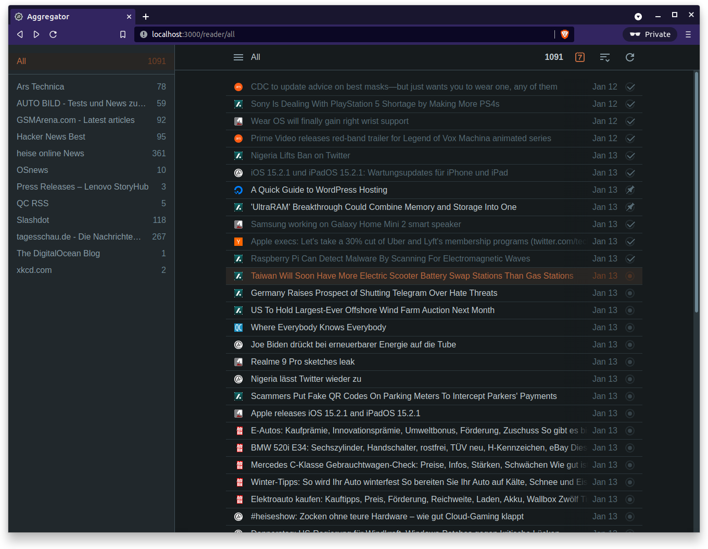
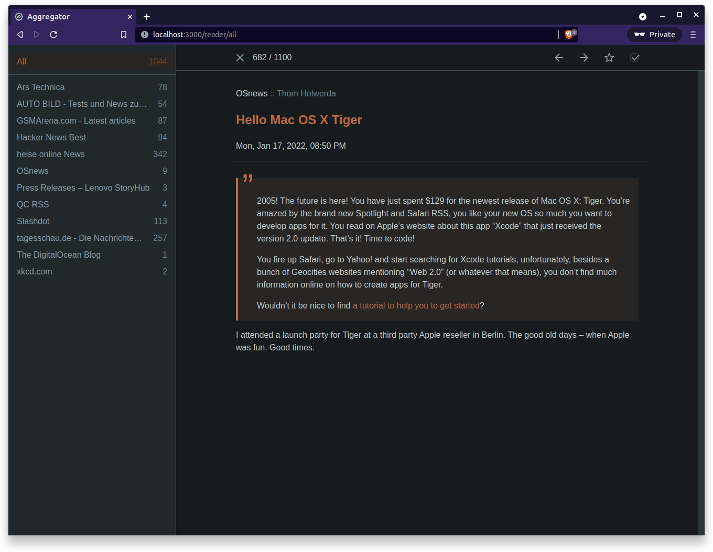

# Aggregator

Python based feed reader/aggregator.

Planned features:
- Support for RSS and Atom feeds ✔
- Entry filtering support
- Feed aggregation / syndication
- OPML import ✔
- JSON-based API ✔
- Web client ✔
- Mobile web client ✔
- Android client

### Usage

The easiest way to launch Aggregator is to use docker-compose together with either docker or podman.

	docker-compose up --build

### Web Client Screenshots

### License

Aggregator is free software: you can redistribute it and/or modify
it under the terms of the [GNU General Public License](http://www.gnu.org/licenses/gpl.txt) as
published by the Free Software Foundation, either version 3 of the License, or (at your option) any
later version.
